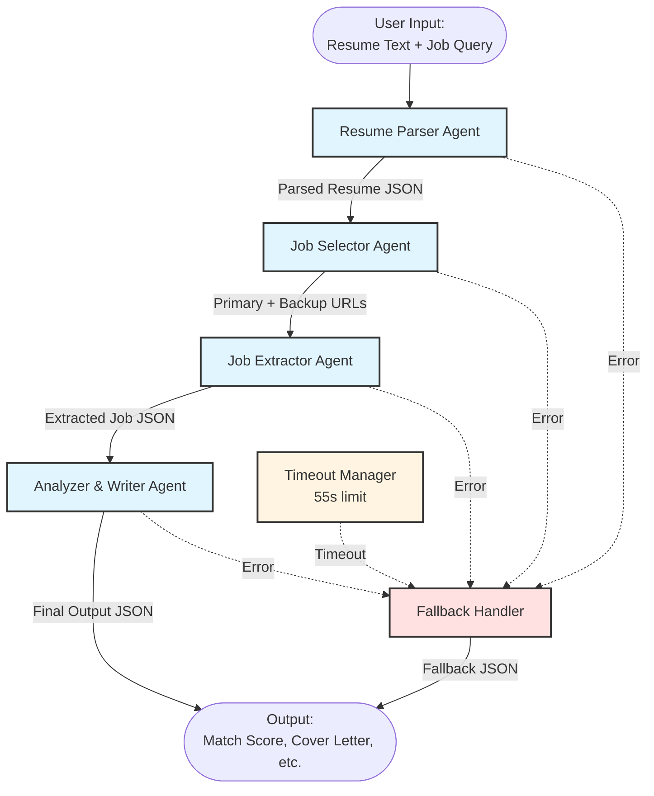
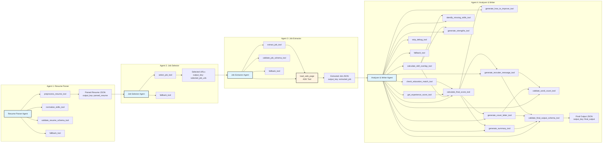
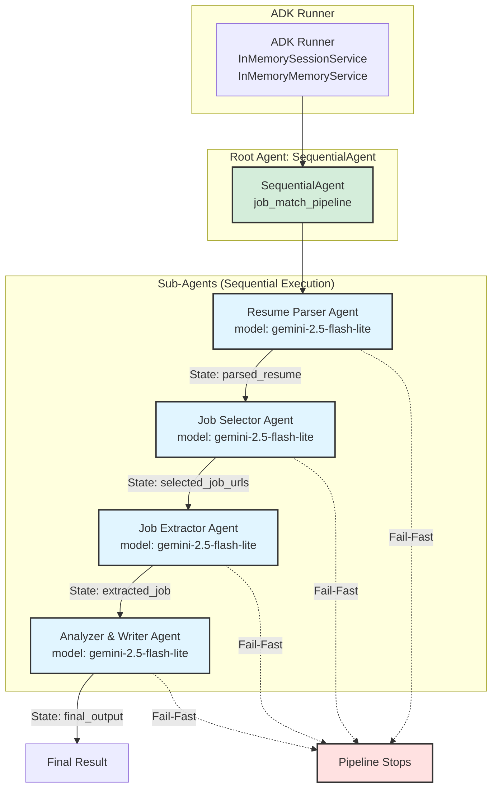
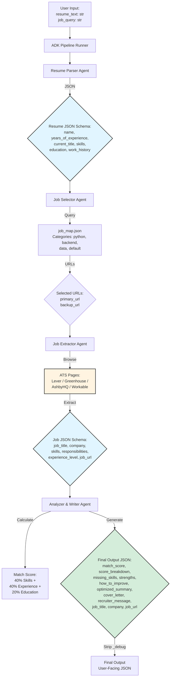
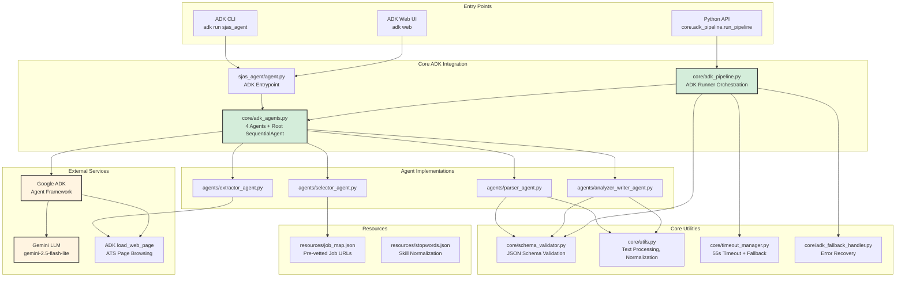
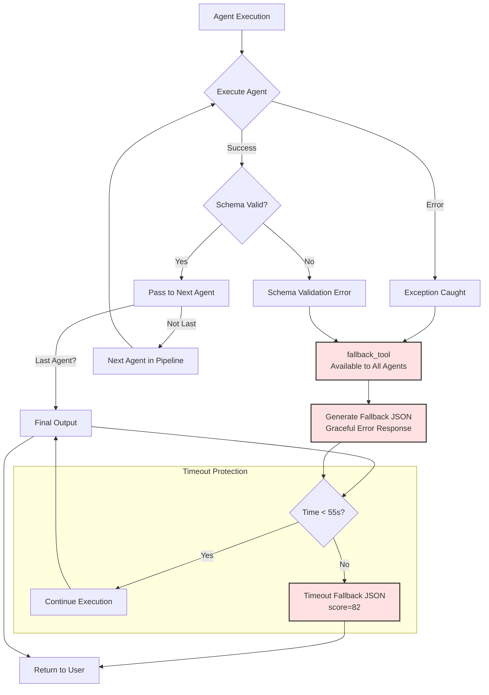
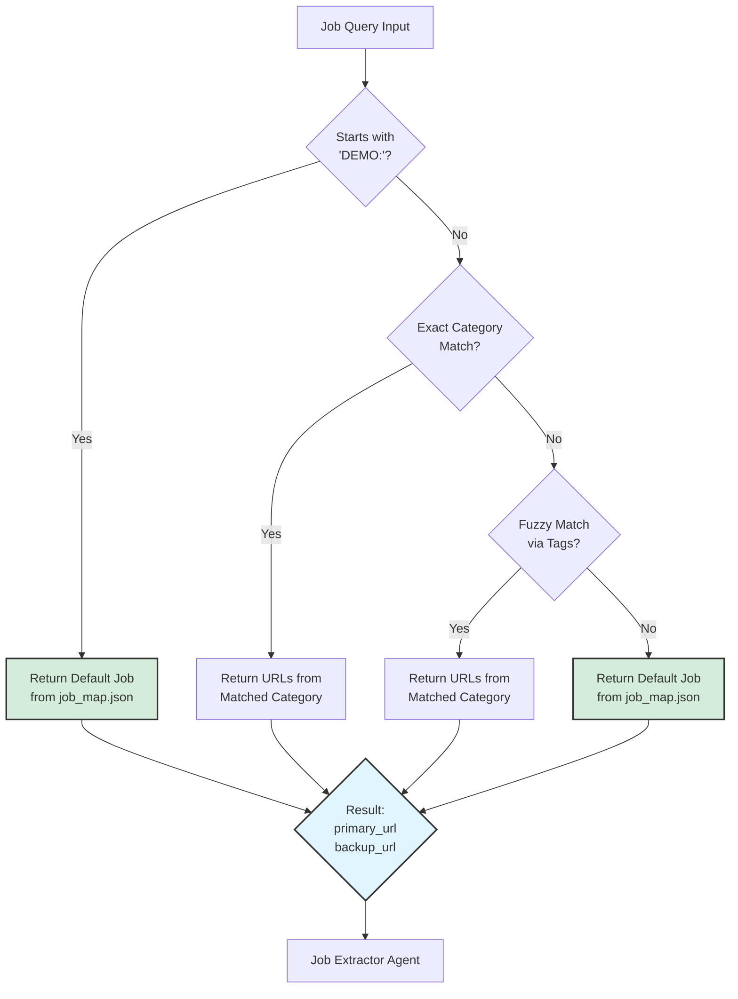
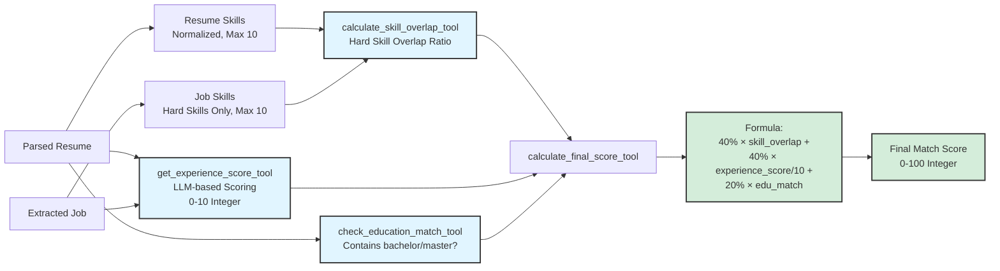

# Smart Job Match & Application Assistant - Architecture Diagrams

This document contains Mermaid diagrams visualizing the architecture, flow, and components of the SJAS system.

## 1. High-Level Architecture Flow

## 2. Detailed Agent Flow with Tools

## 3. Sequential Agent Pipeline (ADK)

## 4. Data Flow Diagram

## 5. Component Architecture

## 6. Error Handling & Fallback Flow

## 7. Job Selection Logic Flow

## 8. Scoring Algorithm Flow

## Usage

These diagrams can be rendered in:
- GitHub (native Mermaid support)
- Markdown viewers with Mermaid support
- Online Mermaid editors: https://mermaid.live
- Documentation tools (GitBook, Notion, etc.)

## Notes

- **Fail-Fast Behavior**: SequentialAgent stops immediately if any sub-agent fails
- **Timeout Protection**: Global 55-second timeout enforced at pipeline level
- **Schema Validation**: All JSON outputs validated before passing to next agent
- **Fallback Mechanism**: Each agent has access to `fallback_tool` for graceful error handling
- **ADK Integration**: Uses ADK's `load_web_page` tool for ATS browsing (no external libraries)
- **Memory Enabled**: `InMemoryMemoryService` provides debugging and state tracking

